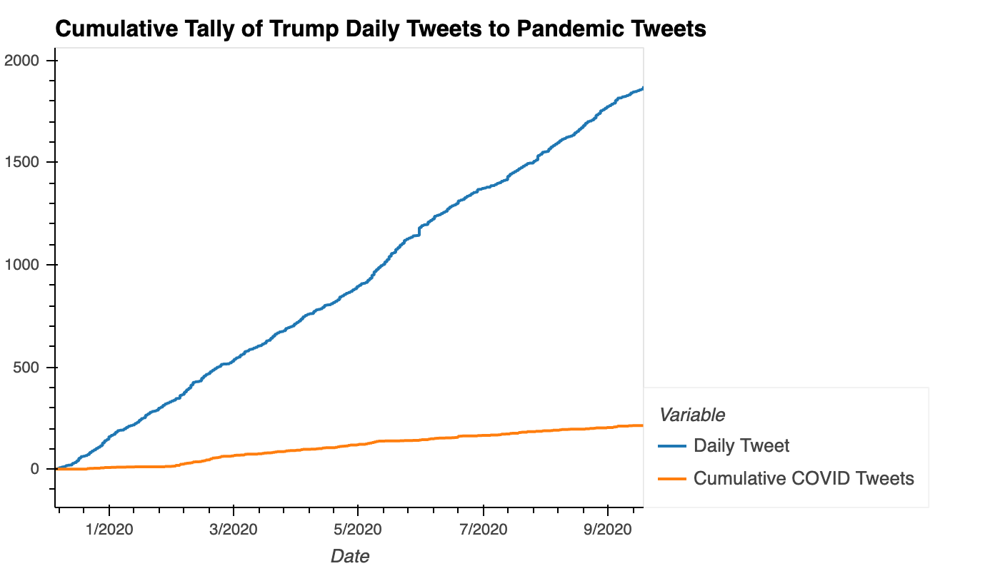
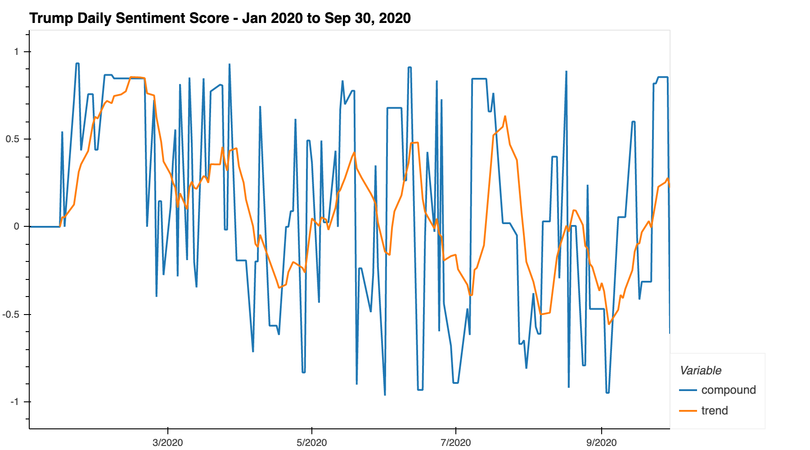

# Sentiment Analysis on Trump Tweets

## Objective
The relationship between President Donald Trump's Tweets and the stock market has been documented by many research companies:
* In September 2019, [a JPMorgan bot analyzed 14,000 Trump tweets and found their increasingly sharp impact on markets](https://markets.businessinsider.com/news/stocks/jpmorgan-volvefe-index-on-impact-of-trump-tweets-on-market-volatility-2019-9-1028508499#)
* Bank of America Merrill Lynch also reported that [on days when President Trump tweets a lot, the stock market falls](https://www.cnbc.com/2019/09/03/on-days-when-president-trump-tweets-a-lot-the-stock-market-falls-investment-bank-finds.html)

Since January 2020, the markets have been increasingly volitile due to the global upset caused by coronavirus. As such, the aim of our project is to explore whether this phenomena observed in Trump's Tweets was still occuring in 2020. Specifically, whether Trump's Tweets were affecting the stock prices of companies that were developing vaccines for coronavirus.

To explore this phenomena, we obtained and analysed Trump's Tweets compared to stock prices from January 1, 2020 to September 30, 2020.

**The following README file will discuss two notebooks related to the Sentiment Analysis of Trump's Pandemic Tweets**
1. TwitterScrape.ipynb - a notebook used to scrape and process tweets from Twitter using Selenium 
2. sentiment_analysis.ipynb - a notebook used to clean the twitter data and analyse tweets for sentiment

*A listing of the libraries required to run the document can be found at the end of the README file.*

## Sentiment Analysis Outline

In order to use the sentiment from Trump's Tweets as a feature in our machine learning models, we were required to do complete three tasks:

1. Extract Trump's Tweets from Twitter
2. Extract tweets related to the pandemic (called 'Pandemic Tweets')
3. Assign a sentiment score related to the Pandemic Tweets

### Part 1 - Extract Trump's Tweets from Twitter (TwitterScraper.ipynb)

There are a number of python libraries available to extract tweets from twitter. Twitter's own library called 'Tweepy' allows users to extract tweets for the last 7 days. Since our models required data from January 1, 2020 to Sept 30, 2020, we needed a more robust library to gather data from farther back.

We explored using the library GetOldTweets3 but unfortunately Twitter changed their endpoints approximately four days prior to the start of our project. This change caused the library, along with a host of others libraries to become unusable. In order to obtain the data, we scraped Twitter using Selenium. 

The resulting code was then processed with BeautifulSoup.

### Part 2 - Finding 'Pandemic Tweets' (sentiment_analysis.ipynb)

A Regular Expression (Regex) pattern was used to identify tweets containing one of the following strings of characters:
* china
* flu
* vaccine
* covid
* corona
* chinese
* pharma

Tweets containing one or more of these strings of characters were flagged as 'Pandemic Tweets' to be extracted, analysed, and used as a feature in our machine learning models.

### Part 3 - Assigning a Sentiment Score

'Pandemic Tweets' were then assigned a sentiment score using the VADER sentiment analyzer. 

Since Pandemic Tweets only occured on approximately 46% of the days between Janaury 1st and September 30, 2020, we were required to fill the missing days with data to align with the availability of stock data. As such, we chose to forward fill the previous day's sentiment score into days which were missing data.

Weekends and non-trading days were then dropped to align with the availability of stock data.

The data was then exported to a CSV file to be used in the machine learning models.

### Analysis of Preliminary Findings

The main goal of these notebooks was to create a CSV file with Trump's sentiment analysis for use in our machine learning models. However, there are some fun preliminary findings.

* Trump only Tweeted about the pandemic 46% of the time:

* In total, of trump's 1881 tweets between January 1 and September 30, 2020, only 11% of his Tweets were 'Pandemic Tweets'
* Analysis of Trump's sentiment scores in Pandemic Tweets between January 1 and September 30, 2020 show that he is becoming increasingly negative:

Overall the POTUS does not seem to be doing to great. Please view the machine learning notebooks for further analysis of the impact of Pandemic Tweets on companies stock prices who are developing a vaccine.

----
*Required Libraries*

* pandas
* numpy
* pandas_market_calendars
* nltk
* nltk.sentiment.vader
* hvplot.pandas

*libraries specific to TwitterScraper:*
* requests
* BeautifulSoup
* Selenium (note: you will need a webdriver for FireFox)

----

